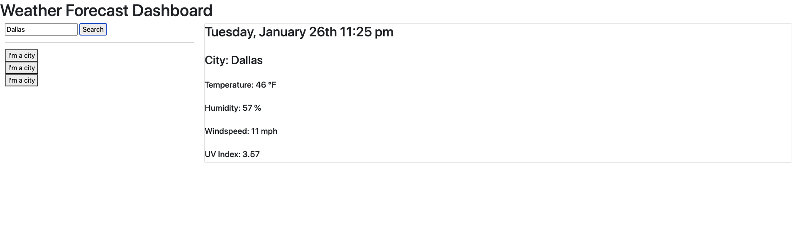

# Weather Forecaster Application

The goal of this application was to present a user with weather data for a given city. Leveraging the API's offered by [openweathermap.org](https://openweathermap.org/api), we fetched the information provided and placed them on the page for the user to access in a simple and stream-lined interface.

When the user searches for their desired city in the panel on the lefthand side of the application, the respective information regarding: city, temperature, humidity, windspeed, and ultraviolet index (UV Index) will appear in the center of the page. Above the section that provides the user with the selected current weather data, the day, date, and time are also displayed. In addition to the current weather information supplied, a section containing a five-day forecast will also appear below, with the associated dates, temperatures, and humidity percentages, and visual icons representing weather conditions for each day.

Should the user decide to search the weather conditions for another city, they may do so by simply entering a new input to the search box. Their last search will be saved as a clickable button below said box, and can be accessed later. The new search shall prepended to the top of this formed list of city searches, where each button will access the weather information upon each click. If the user refreshes the page, or leaves, their past searches will be saved in the side panel under the search box, and the last loaded city and its assocaited weather data will appear on the page upon reloading.

Check the weather near you **[here!](https://jimbopulos.github.io/weather-app/)**
