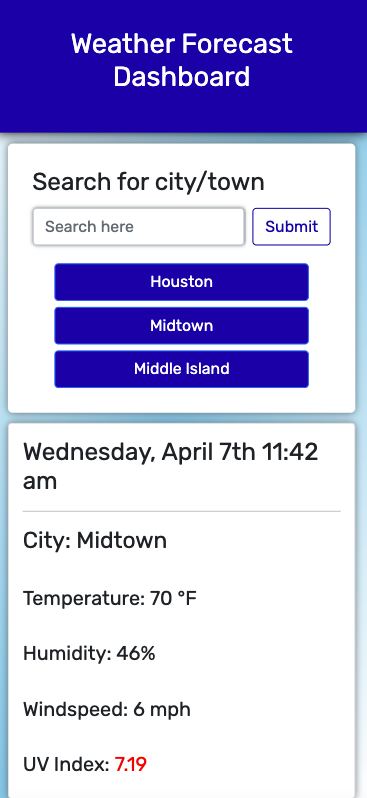
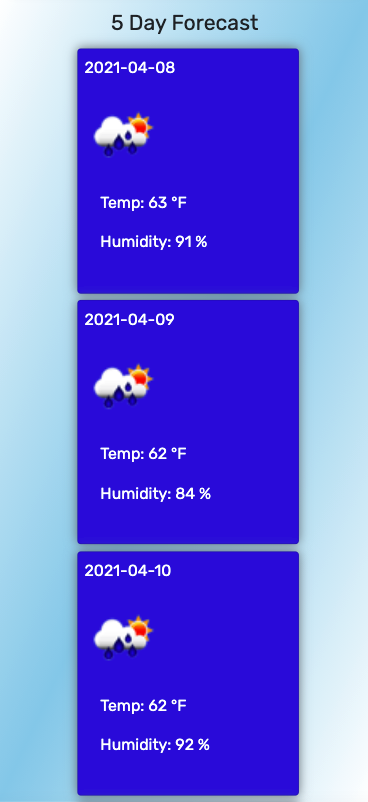

# Weather Forecaster Application

## Description

Obtain weather data for a given city. Leveraging the API's offered by [openweathermap.org](https://openweathermap.org/api), information will be provided on the page for the user to access in a simple, stream-lined interface.

## Table of Contents

- [Installation](#installation)
- [Usage](#usage)
- [Technologies](#technologies)
- [Deployed URL](#deployed-url)
- [License](#license)

## Installation

Navigate the [deployed URL](#deployed-url) to begin using this app.

## Usage

1. Find the `Search for city/town` form on the lefthand side of the page.
2. Click `Search` or press the enter key to search a city.
3. The chosen `City`, with current `Temperature`, `Humidity`, `Windspeed` (in mph), and ultraviolet index (`UV Index`) will be displayed in to the right.
4. A user may select any of the previously searched cities under the search form in order to check weather data at a later point.
   **NOTE** Your searched city list will persist upon page exit or refresh.

## Technologies

- `HTML`
- `CSS` and `Bootstrap`
- `JavaScript`
- `OpenWeatherMap` API

## Deployed URL

Check the weather near you **[here!](https://jimbopulos.github.io/weather-app/)**

## Questions

If you have any questions, please contact jimbopulos at james.mgalantino@gmail.com

## License

MIT License

Copyright (c) 2021 James Galantino

Permission is hereby granted, free of charge, to any person obtaining a copy
of this software and associated documentation files (the "Software"), to deal
in the Software without restriction, including without limitation the rights
to use, copy, modify, merge, publish, distribute, sublicense, and/or sell
copies of the Software, and to permit persons to whom the Software is
furnished to do so, subject to the following conditions:

The above copyright notice and this permission notice shall be included in all
copies or substantial portions of the Software.

THE SOFTWARE IS PROVIDED "AS IS", WITHOUT WARRANTY OF ANY KIND, EXPRESS OR
IMPLIED, INCLUDING BUT NOT LIMITED TO THE WARRANTIES OF MERCHANTABILITY,
FITNESS FOR A PARTICULAR PURPOSE AND NONINFRINGEMENT. IN NO EVENT SHALL THE
AUTHORS OR COPYRIGHT HOLDERS BE LIABLE FOR ANY CLAIM, DAMAGES OR OTHER
LIABILITY, WHETHER IN AN ACTION OF CONTRACT, TORT OR OTHERWISE, ARISING FROM,
OUT OF OR IN CONNECTION WITH THE SOFTWARE OR THE USE OR OTHER DEALINGS IN THE
SOFTWARE.
